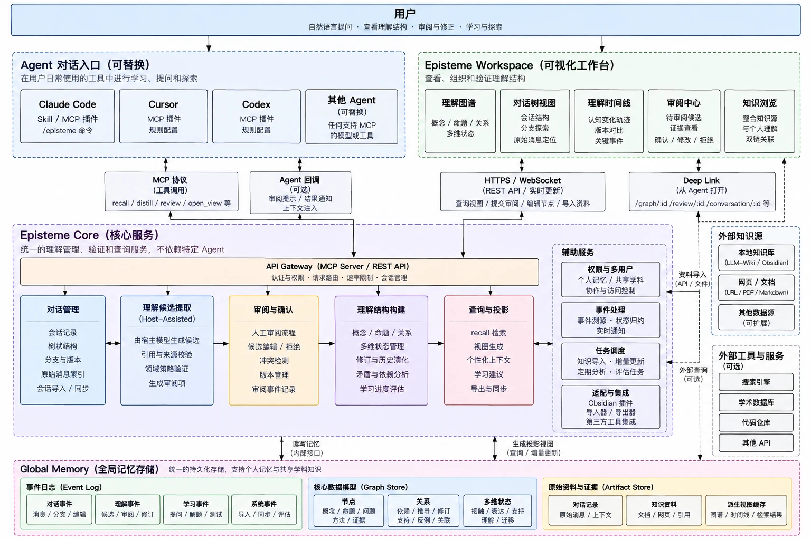

# Target architecture

What Episteme is meant to become, as one picture, the constraints that keep it what it is, and how far each
part of it is built. [overview.md](overview.md) describes the layers that exist; this document describes the
whole they belong to.

Use it in two ways. Before adding a module or moving a boundary, find the module here and check its tier and
constraints. When a change does not fit, either the change is drifting or this document is wrong, and an ADR
decides which. An accepted ADR wins over this document, which is then updated to match it.

The picture is the vision as drawn. Where the text below differs from it, the text is the version that
holds: mostly on naming, on what goes in which store, and on order.

## The parts

**The user** asks questions in natural language, looks at how they understand something, reviews and corrects
what was suggested, and learns. Every part below exists for one of these.

**Agent entrances, replaceable.** The tools the user already works in: Claude Code (a plugin with a skill, an
MCP configuration and an `/episteme` command), Cursor, Codex, and any other host that speaks MCP. Episteme
does not ship an agent of its own. The host supplies the model; Episteme supplies the understanding the model
should build on.

**Episteme Workspace.** Where the user sees, organises and verifies their understanding:

| view                   | shows                                                                                              |
| ---------------------- | -------------------------------------------------------------------------------------------------- |
| understanding graph    | concepts, claims, relations, and the state of each along several dimensions                        |
| conversation tree      | the conversations understanding came from, their branches, and the message a part began in         |
| understanding timeline | how understanding of something changed, version against version, and the events that did it        |
| review centre          | pending candidates with their evidence, to accept, modify or dismiss                               |
| knowledge browsing     | outside knowledge (an LLM-Wiki, an Obsidian vault) beside personal understanding, linked both ways |

**Episteme Service.** The single service that holds and validates understanding, independent of any one agent
or surface. The picture calls it _Episteme Core_; in this repository `core` is the name of one library inside
it (see _Naming_). It is reached through one gateway that serves MCP and a REST API, and is made of:

| module                  | does                                                                                                                                                  |
| ----------------------- | ----------------------------------------------------------------------------------------------------------------------------------------------------- |
| conversation management | keeps conversations, their tree and their messages, imports and syncs them                                                                            |
| candidate extraction    | the host's model proposes candidates; Episteme checks each quote against its source, validates it against the domain policy, and queues it for review |
| review and confirmation | the human decision on each candidate: accept, modify, dismiss; conflicts shown, never settled                                                         |
| structure building      | concepts, claims and relations; state along several dimensions; revision history; contradiction and dependency                                        |
| query and projection    | `recall`, views, context for one person, export and sync                                                                                              |

Beside them, supporting services: identity and access (personal memory, shared subject knowledge, who may
read what), event processing (event sourcing, state reduction, notification), task scheduling (import,
incremental update, periodic analysis), and adapters (an Obsidian plugin, importers and exporters, other
tools).

**Global memory.** The durable store under the service:

- **event log**: several streams, kept apart (see constraint 3);
- **graph store**: nodes, edges, and the state each actor holds;
- **artifact store**: conversations, imported material, and caches of derived views.

**Outside sources and tools.** Local knowledge bases (an LLM-Wiki, an Obsidian vault), web pages and
documents, other data sources; optionally search engines, academic databases and code repositories. All of
them are material: they reach understanding only through extraction and review.

## Constraints that hold across the picture

These follow from the [project invariants](../../AGENTS.md#project-invariants) and are what keep the picture
from turning into a different product.

1. **Agents propose, people confirm.** Nothing an agent sends can confirm a candidate or name who confirmed
   it. The agent-facing interface has no confirm operation. Confirmation comes from the Workspace, or from a
   form shown by a host trusted to show it to the person ([ADR 0008](../decisions/0008-agent-plugin-surface.md),
   _Trust boundaries_). Which protocol a request uses is not authorization: until the service enforces
   identity and per-operation permissions, any local process that reaches it can attempt a decision, and that
   is documented as a limitation rather than presented as a guarantee.
2. **Conversations and material are Episteme data, not understanding.** Conversation turns, their
   parent-child relationships, branches and source references belong to Episteme's data model, held
   authoritatively by the service in the artifact store, append-only and referenced by provenance. A
   Workspace projects them as a tree and never owns them. An imported conversation keeps its source, and is
   not stored as a complete tree when its branches were not supplied. Nothing in a conversation enters the
   understanding graph except through review ([ADR 0009](../decisions/0009-distillation.md),
   [ADR 0010](../decisions/0010-episteme-service.md)).
3. **Understanding events are their own stream.** The event log holds several streams: understanding events,
   which are append-only and the only source of current understanding; review records, which say who
   decided what about which candidate; and conversation and system events (messages, imports, syncs,
   evaluations), which are operational. No other stream writes into the first.
4. **Vocabulary comes from domain packs.** Node types, relations and state dimensions are registered by a
   pack. The service and its stores know that a relation exists, not which relations there are.
5. **Teaching strategy is an application concern.** Learning suggestions and progress evaluation are built
   on projections in the Workspace or a scene application, never inside the service's core modules.
6. **Private before shared.** Multi-user access and shared subject knowledge come after scoped recall and
   encryption at rest. Sharing is an explicit contribution, never a default.
7. **Agents pull context.** A host gets understanding by calling `recall`, at moments its skill or
   configuration defines. A callback to the agent (review prompts, result notifications, context injection)
   is an enhancement for hosts that support it, never the only path.
8. **Core stays a library.** `@episteme/core` does no I/O, opens no connection and calls no model. Whatever
   needs those belongs to the service around it.

## Naming

| in the picture                         | in this repository                                                                         |
| -------------------------------------- | ------------------------------------------------------------------------------------------ |
| Episteme Core (the service)            | the Episteme service, `apps/service`: a host process built from the packages below         |
| structure building, event processing   | `@episteme/core`: graph, guards, event log, projection, retrieval                          |
| candidate extraction                   | `@episteme/distillation`, with policies from domain packs such as `@episteme/domain-learn` |
| review and confirmation                | `@episteme/application` (`LearnSession.decide`)                                            |
| API gateway, MCP side                  | `@episteme/mcp`                                                                            |
| graph store, event log, artifact store | `@episteme/storage-local` and the draft and source files beside the graph                  |
| Episteme Workspace                     | the Learn page today; a Workspace application of its own, possibly in its own repository   |

## How far each part is built

Three tiers: **built** exists and is tested; **next** is what the next phases build, in order; **later** waits
on something named.

| part                    | built                                                                                                                           | next                                                                                        | later                                                       |
| ----------------------- | ------------------------------------------------------------------------------------------------------------------------------- | ------------------------------------------------------------------------------------------- | ----------------------------------------------------------- |
| agent entrances         | MCP over Streamable HTTP: `recall`, `propose`, `reflect`, `distill`                                                             | a Claude Code plugin: skill, MCP configuration, `/episteme`                                 | verified configurations for Cursor, Codex and other hosts   |
| API gateway             | the Episteme service (`apps/service`): MCP at `/mcp`, versioned REST at `/api/v1`, one boundary, revisions, contract tests      | a Workspace on its own origin, through an allowlist                                         | authentication, rate limits                                 |
| conversation management | learning material kept beside the graph, split into episodes                                                                    | importing Claude Code conversations into the artifact store                                 | the conversation tree, branches, sync                       |
| candidate extraction    | a rule-based distiller; host-model extraction with exact quote verification (ADR 0011); domain policy; provenance per candidate | use with a real host, measured: quote refusals, basis, review effort                        | incremental extraction on import                            |
| review and confirmation | one decision path; crash-consistent and idempotent; candidates that refer to candidates                                         | lower review effort: batch decisions on low-risk kinds, review inside the host and Obsidian | contradiction candidates surfaced at review                 |
| structure building      | Core: registered vocabulary, guards, append-only state events, forks                                                            | —                                                                                           | dependency analysis                                         |
| query and projection    | `retrieve`, `project`, `recall` with reasons                                                                                    | one-way export of understanding into an Obsidian vault                                      | learning suggestions (in an application), sync              |
| Workspace               | the Learn page, served by the service: a topic view and a review queue (not yet showing a suggestion's basis or speaker)        | review centre, understanding graph, understanding timeline                                  | conversation tree view, knowledge browsing, deep links      |
| identity and access     | one graph, one owner, a single-owner lock                                                                                       | —                                                                                           | scoped recall, then multi-user and shared subject knowledge |
| event processing        | state reduction; a write-ahead record of decisions                                                                              | separate streams for review records and operational events                                  | notifications, real-time updates                            |
| task scheduling         | —                                                                                                                               | —                                                                                           | incremental import, periodic analysis                       |
| global memory           | JSONL graph and event log; draft and source files; plain text                                                                   | —                                                                                           | encryption at rest (before anyone else uses it)             |

## Order

1. **Make it usable where the user already works.** Separate the service from the Learn surface, build
   host-model extraction, and package the Claude Code plugin. Each starts with its own ADR. This is what
   lets the loop be used, and measured, inside Obsidian and Claude Code.
2. **The Workspace's first views.** Review centre, understanding graph, understanding timeline. The data for
   the timeline already exists as each actor's event history.
3. **Privacy.** Scoped recall and encryption at rest, before anyone other than the graph's author uses it.
4. **Everything that assumes more than one person or more than one session at a time.** The conversation
   tree, scheduling, real-time updates, multi-user access, shared subject knowledge, and Forum as a second
   scene.

The [roadmap](../roadmap/README.md) turns these into phases and records what each one proves.
